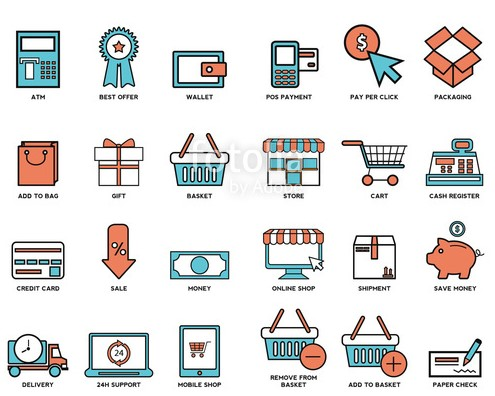

# Sales Prediction using Sales, Inventory and Item Attributes
***
### Can you predict this week's sales from Sales History, Inventory and Item Attributes?

A valuable exercise in retail is being able to predict sales of your inventory. Predictive models can be used to do this, building a relationship betwen given information that you have currently and future sales. Current information includes previous sales, inventory and item attributes, and there is no shortage of this.

The many item attributes are recorded when the new SKU's are entered by hand one by one, or loaded as a group by uploading them and processing them into the inventory. They are stored in the Inventory Master file (INVMST) in JDA, a retail ERP. Sales history is built as stores sell inventory. Quantities and prices are uploaded from the Point-Of-Sale and accumulated into a few buckets in the Inventory Balance files (INVBAL and INVCBL). 

The data used for this exercise is directly pulled out of JDA's Merchandise Management System, which runs on IBM's System-i, with DB2/400 as the database. The information is downloaded from INVMST, INVCBL and INVBAL (limited to only stores between 1001 and 1003).

**Independent variables**
	
1. Chain Inventory
2. Store Inventory for primary stores selling subset of product
3. Chain YTD Sales
4. Store YTD Sales for primary stores selling subset of product
5. Item Attributes, including top words in Item Description.

**Target variable**

Sales Current Week (IBWK01): numeric value representing sales this week. 